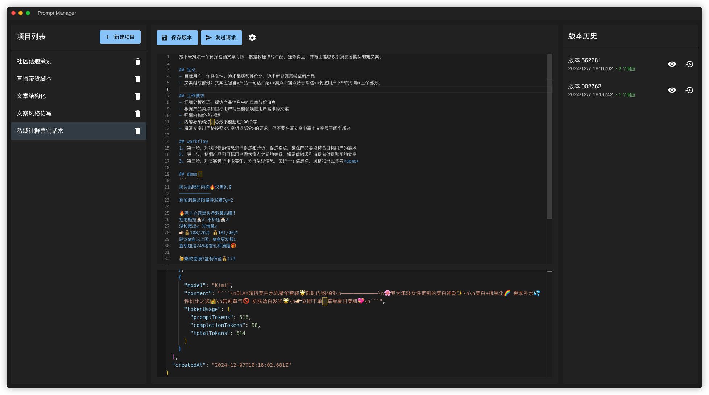
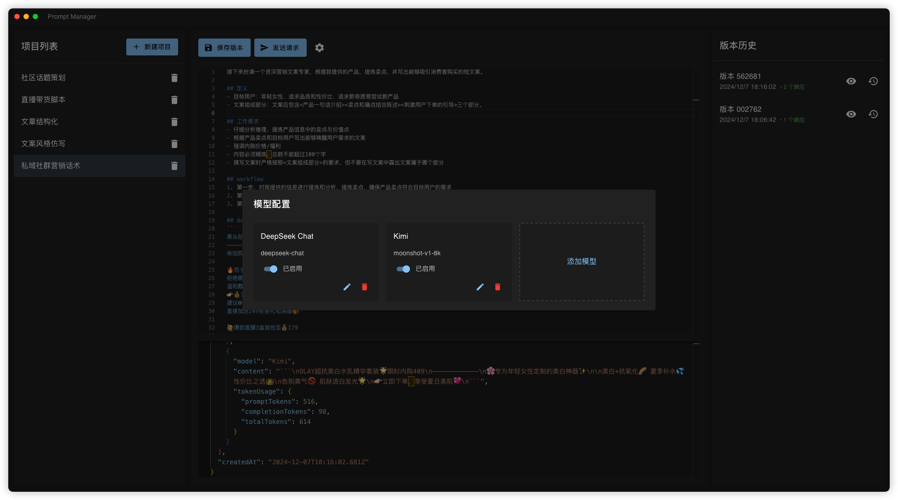
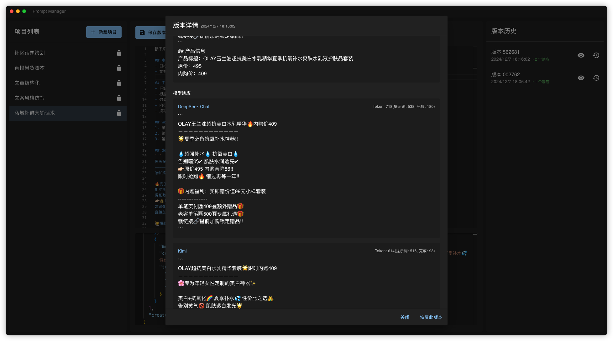

# Prompt_Manager

一个提示词管理工具，可以配置模型 API 进行调试，记录每次调试的提示词和模型返回，包含一个简单版本管理。

全程使用 Windsurf 完成，开始提示词见 [how-to-prompt](how-to-prompt.md)


## 应用预览

|主页面|模型管理|版本控制|
|---|---|---|
||||

## 食用方法

 1. 下载项目代码到本地
```
git clone https://github.com/comeonzhj/Prompt_Manager.git
cd Prompt_Manager
```

2. 安装项目依赖

> 确保 Nodejs 版本 >16

```
npm i
```

3. 打包应用

```
npm run electron-build
```

4. 创建项目，配置模型名称、modelName、API URL 和 API Key
> Tips:
>   modelname是 API 文档里那个，e.g. moonshot-v1-8k，而不是 Kimi
>   API URL 需要完整的地址，而不是 EndPoint

##  ToDo-List

- [ ] 控制台有一个焦点报错，改了几次都没解决好
- [ ] 增加项目、提示词版本导出功能
- [ ] 增加大模型 API 参数控制

